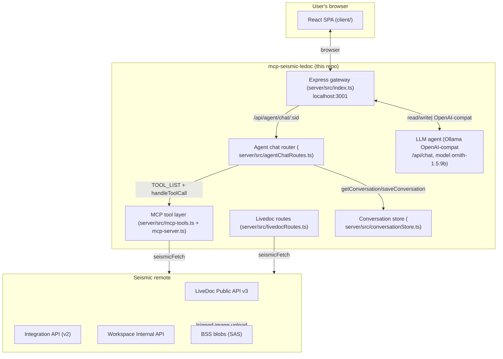
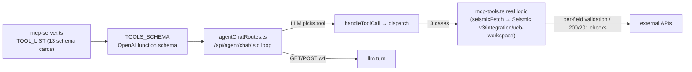
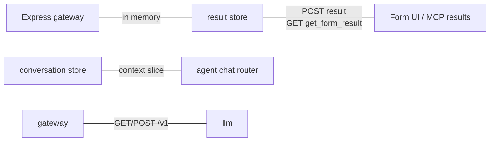
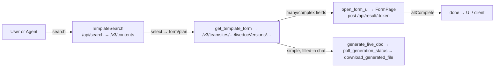

# mcp-seismic-ledoc — High-Level Architecture

The **mcp-seismic-ledoc** project is a **local, agent-facing LiveDoc gateway**: a small Express server
on `localhost:3001` that (a) hosts a React SPA (`client/`) for a user, and (b) acts as a **tool
front-end for an LLM agent** (a local OpenAI-compatible model, typically running on Ollama).

It is **not** a remote API and **not** an MCP server with a stdio/SSE transport. It **mimics enough of
the MCP protocol** — a `TOOL_LIST` schema plus a call dispatcher (`handleToolCall`) — so that the local
model can *discover* and dynamically **choose** which LiveDoc tool to invoke. Every one of those tools
is implemented here, and the front-end client is **not** the source of truth for them.

The agent is a **drive-offload / write-offload**: the React *application* (form filling, generation
polling, download) does the real work; the agent only navigates that flow by picking tools. Both paths
talk over ordinary HTTP JSON, through the same Express layer.

```
Architecture in one line: a localhost Express gateway = SPA host + OpenAI-compat proxy that hands an LLM
a toolbox of Seismic LiveDoc tools — with a big system prompt and URL/token *fabrication guards* keeping
the tiny local model honest (it must never invent ids or links).
```

---

## 1. System relationships (top-level)



---

## 2. Code layout

| Area | Files | Responsibility |
|---|---|---|
| **Bootstrap** | `server/src/index.ts` | Express `cors`, JSON parsing (`10mb`); mounts `livedocRoutes` (SPA serve + API) then `agentRouter` (agent chat + OpenAI-compat for the model). |
| **API/SPA routing** | `server/src/livedocRoutes.ts` | `set-token` (hot-reload token), `result/:token` (POST), `result/:token` (GET), `search`, `template/:teamSiteId/:versionId`, `generate`, `status`, `download` (proxy-stream), `image/upload`, `ucb-generate`, `ucb-status`. Two asyncHandler layers (open + per-route) wrap every async handler. |
| **MCP tools** | `server/src/mcp-tools.ts` | Source of truth for all 13 tool functions (`search_templates`, `get_template_form`, `generate_live_doc`, `poll_generation_status`, `download_generated_file`, `open_form_ui`, `get_form_result`, `find_doccenter_profile`, `list_workspace_spaces`, `list_workspace_folders`, `submit_ucb_workspace_generation`, `get_ucb_workspace_generation_status`). Also derives Integration/Internal base URLs + the in-memory result store. |
| **MCP protocol shim** | `server/src/mcp-server.ts` | 13-card `TOOL_LIST` schema **and** `handleToolCall` switch-dispatcher (parses LLM JSON args, returns results). The same logic backs the OpenAI `TOOLS_SCHEMA`. |
| **Session store** | `server/src/conversationStore.ts` | TTL-capped in-memory sessions (2h TTL, 500-session hard cap): `get/save conversation + eviction`. |
| **Client** | `client/src/{main,App}.tsx`, `client/src/components/*`, `client/src/types.ts` | React SPA (react-router-dom, Vite single-file build). `App.tsx` styles + 3 routes. Widgets: Date/ImageUpload/Number/SlidePicker/Table/Text/Toggle. |

---

## 3. Tool layer (TOOL_LIST → dispatcher → API logic)



| Tool | Purpose | Notable logic |
|---|---|---|
| `search_templates` | `POST /v3/contents`. Returns `contentProfiles`/`profileVersionIds` arrays (parallel — `profileVersionIds[i]` ⇄ `contentProfiles[i]`) for UCB origin lookup. | `filter` vs free-text `searchText:name` **mutually exclusive** (combining both over-constrains → 0 results). |
| `get_template_form` | Load a template definition; normalises PascalCase→camelCase. | Moves `manualSelectContentInput` out of the returned body. |
| `generate_live_doc` | Submit a liveDoc (`POST`); only `200/201` accepted. **Write tool.** | |
| `poll_generation_status` | `GET` job status + per-output `status/format/name/fileName/errorString`; all outputs done/failed ⇒ done. | `statusName` bridges number→`Queued/Generating/Completed/Failed` (or passthrough string). |
| `download_generated_file` | Proxy-stream of one output to the browser (output id + `jobId` query param carries generatedLivedocId). | Must use `download_generated_file` id, never a guessed URL. |
| `open_form_ui` | Returns **form URL + token** to open in the user's browser; **non-blocking**. Base64-encoded query params (`token`, `context`, `prefill`, `workspace`, `origin`). | With `workspace`+`origin` the FormPage routes through the UCB endpoint instead of the normal download flow. |
| `get_form_result` | Read what the user actually *submitted* via `open_form_ui` (from the in-memory result store). | Reports `submittedInputs.adHocInputs/variableListData` — what the user edited, not just prefill. |
| `find_doccenter_profile` | Resolve profile id/versionId by name (`GET /v2/users/profiles`, Integration API). | Name + team-site match, then partial-name suggestions; warns on 401/403 scope. |
| `list_workspace_spaces` / `list_workspace_folders` | Browse Workspace trees; `?folderId=` drilling. | |
| `submit_ucb_workspace_generation` | Submit a generation whose output lands in a Workspace folder, then auto-commit. | Up-front per-field validation (clear messages). |
| `get_ucb_workspace_generation_status` | Poll a UCB job; commit once Ready; build `workspaceUrl` and return it verbatim. | Dedup guard on commit; warns if commit context lost across restart. |

---

## 4. Chat router: tool-calling loop

The router drives `pollLLM` (GET messages / POST tool call). It builds `messages` from conversation
state, prepends a system prompt, trims the last N messages as context, and parses the model reply:

| Reply type | Router does |
|---|---|
| `{reply}` | Pushes to context, updates messages; loop ends. |
| `{output:tools}` | For each tool: calls `handleToolCall`, appends tool call to context, extracts pinned resources, then calls pollLLM again with the updated messages. |

On **tool errors**, it stores the message, sets an error flag (stops looping for that turn), shows the
error, and **still returns the last stored message** so the user never sees a raw crash.

**Concurrency guard:** before building the next `messages`, it checks there is no in-flight
`pendingMessageId`; if one exists the new poll is cancelled (aborts + removes), so rapid client polling
can't fan out parallel LLM turns. This prevents divergence between what messages state held and what the
session actually polled.

## 5. Token ↔ cross-layer sharing

There is **no cross-process IPC**. The three parties share state like this:

| Shared by | Written by | Read by | Notes |
|---|---|---|---|
| **In-memory result store** | Form UI (`POST result/:token`) | `get_form_result`; agent chat | Token from `open_form_ui`; includes `{generatedLivedocId, outputs, status, message}`. The agent reuses submitted fields in follow-up. |
| **Conversation** | Router on the first turn (seeds with system prompt). If empty/invalid, it replies with a generic "not implemented" JSON + `true` (success). | — | |
| **System prompt** | The router appends it each turn after the initial seed. | — | |



## 6. Config & API routing

```mermaid
flowchart LR
    ENV[environment variables via dotenv] --> CFG[derive at boot]
    SB[SEISMIC_BASE_URL "https://api.seismic-dev.com/qa/livedoc"]
    SB2[SEISMIC_INTEGRATION_BASE_URL]
    SB3[SEISMIC_INTERNAL_BASE_URL]
    SB4[SEISMIC_API_TOKEN → Bearer on every call; HOT-RELOAD via /api/set-token]
    CFG --> LI[LiveDoc base URL = /v3/public]
    CFG --> I[Integration base URL]
    CFG --> U[UCB base URL = /v3]
    ENV -.env file example.-> SB4
```

All base-URL derivation lives in `server/src/config.ts`:
- `LIVE_DOC_BAS_URL = SEISMIC_BASE_URL ?? "https://qa/api.seismic-dev.com/livedoc"` (prod dev).
- `INTEGRATION_BAS_URL`: prod `api.seismic-dev.com/services/integration`.
- `UCB` (LiveDoc base).

| Category | Name |
|---|---|
| `server/src/index.ts` | `PORT=3001` | `OpenAI_BASE_URL, OPENAI_MODEL, SEISMIC_URLS, SEISMIC_API_TOKEN (set via env or /api/set-token). |

## 7. LiveDoc generation flow



## 8. Views (React SPA)

| View | Location | Responsibility |
|---|---|---|
| `TemplateSearch` | `/` | Search templates, select one, fetch its definition via `/template/:teamSiteId/:versionId`. |
| `ChatPanel` | `/chat` | Chat UI (messages + results). |
| `FormPage` | `/fill` | Form wizard: load template, let user fill fields, submit via chat or drive UCB generation. |
| `FormBuilder` | `FormBuilder.tsx` | Renders ad-hoc/variable-list/manual-select/imageUpload; builds the `/generate` payload. |

## 9. Commands

| Command | Purpose |
|---|---|
| `npm i` | Install deps. |
| `npm run dev` | Start everything (OpenAI-compat for the agent + SPA hosting). |
| `npm run preview` | Preview the built SPA. |

## 10. Notes & key points

- **Agent drives, UI works.** The model never constructs URLs — the router strips any URL token that
  doesn't appear in a real tool result.
- **Single server owns MCP logic.** Tool functions (`server/src/mcp-tools.ts`) are the source of truth;
  `handleToolCall` is the same. The UI is not.
- **Three concurrent LLM processes.** `express` proxy → `llm` via `/v1/chat` (OpenAI-compat, not stdio/SSE).
- **Token store.** All API calls use `Authorization: Bearer <token>`. The token can be hot-reloaded via
  `POST /api/set-token`, no restart needed.
- **Guard rail. Read-only tools are always advertised; generate/submit are hidden.
- **UCB auto-commit. Once the status is Ready, `commitToWorkspace` (a 606 endpoint) runs on the same node,
  dedup-guarded; warns if commit context was lost across a restart.
- **Form-vs-chat entry points. The form UI and chat share the same result token flow.
- **Server-wide.** The server runs `express` (no `@types/express` in this build) with `NODE_ENV` gates on
  `express` behavior; there's no build step, everything is a plain HTTP server.
